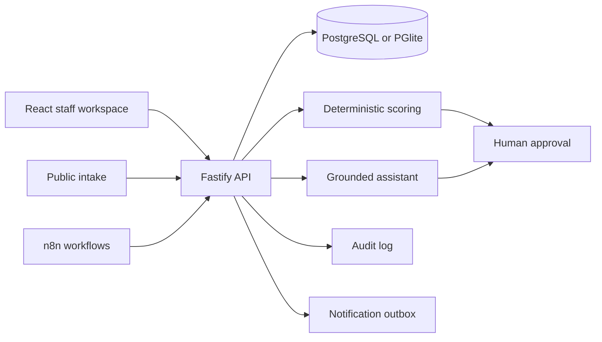

# Dental Clinic AI Operations Suite

> A production-oriented reference implementation for a fictional dental clinic. It is **not** presented as a live client deployment and uses synthetic data only.

NovaSmile combines patient intake, appointment operations, an explainable no-show risk score, approved-knowledge assistance, human approval, workflow automation, audit history, and a responsive management dashboard in one runnable monorepo.

## Why this product exists

Dental teams lose time across disconnected forms, inboxes, calendars, reminder tools, and manual follow-up. This project demonstrates how probabilistic AI can assist a clinic while deterministic rules and accountable people retain decision authority.

### Boundaries

- The assistant does not diagnose, prescribe, recommend treatment, or interpret clinical results.
- Urgent signals trigger administrative escalation; they do not create a medical conclusion.
- Estimates, sensitive messages, and exceptional actions stay behind a human approval gate.
- Only approved knowledge articles may ground an answer.
- Every automated or AI-assisted action creates an audit record.

## Product surfaces

- Staff login with role-based access
- Live operations dashboard
- Appointment and patient views
- Explainable no-show scoring
- Public intake with consent validation
- Administrative urgency routing
- Human approval queue
- Approved-source clinic assistant
- Idempotent reminder and follow-up workflows
- Dry-run notification outbox
- Audit log and failure state persistence

## Architecture



## Technology

| Layer      | Choice                                                                     |
| ---------- | -------------------------------------------------------------------------- |
| Web        | React 19, TypeScript, Vite, Recharts                                       |
| API        | Fastify 5, Zod, JWT, rate limiting                                         |
| Data       | PostgreSQL 16; embedded PGlite for zero-cost demo and tests                |
| Automation | Controlled workflow service plus importable n8n references                 |
| AI         | Deterministic local retrieval, injection checks, approved-source grounding |
| Quality    | Vitest, Testing Library, TypeScript strict mode, ESLint, CI                |
| Deployment | Docker Compose, Nginx, GitHub Actions                                      |

## Quick start without paid services

Requirements: Node.js 22+ and npm 11+.

```bash
npm install
cp .env.example .env
npm run dev
```

- Web: `http://localhost:5173`
- API health: `http://localhost:4000/health`

Demo staff account:

```text
Email: admin@novasmile.demo
Password: DemoClinic!2026
```

The default data layer is embedded PostgreSQL-compatible PGlite. No cloud account or API key is required.

## Docker

```bash
docker compose up --build
```

- Web: `http://localhost:8080`
- API: `http://localhost:4000`

Change all demonstration credentials and secrets before any non-local deployment.

## Quality gates

```bash
npm run typecheck
npm run build
npm test
npm run lint
npm run format:check
```

The suite contains more than 180 meaningful checks across domain logic, schemas, integration, API security, AI evaluation, workflows, frontend interaction, and regression behavior. Coverage thresholds apply to testable source files; generated output and entrypoints are excluded.

## Repository map

```text
apps/
  api/                 Fastify API, database, agents, workflows, tests
  web/                 React workspace and responsive dashboard
packages/
  shared/              Shared validation contracts and types
automation/n8n/        Importable, disabled-by-default workflow references
docker/                Container and Nginx configuration
docs/                  Business, architecture, security and operations manuals
.github/workflows/     CI quality and container validation
```

## Documentation

- [Product contract](docs/PRODUCT_CONTRACT.md)
- [Architecture and data flow](docs/ARCHITECTURE.md)
- [API reference](docs/API.md)
- [Security and privacy](docs/SECURITY.md)
- [Testing strategy](docs/TESTING.md)
- [Version 1.0 test report](docs/TEST_REPORT.md)
- [Deployment guide](docs/DEPLOYMENT.md)
- [Customization guide](docs/CUSTOMIZATION.md)
- [User manual](docs/USER_MANUAL.md)
- [Administrator manual](docs/ADMIN_MANUAL.md)
- [Personas and user stories](docs/PERSONAS_AND_STORIES.md)
- [Production-readiness checklist](docs/PRODUCTION_READINESS.md)
- [Limitations](docs/LIMITATIONS.md)
- [Roadmap](docs/ROADMAP.md)

## Honest production status

This repository is a tested reference product, not a claim of HIPAA, PIPEDA, PHIPA, GDPR, or clinical-device compliance. A real deployment requires legal review, a threat model tied to the hosting environment, vendor agreements, backup/restore drills, secrets management, monitoring, incident response, accessibility verification, and validation against the clinic's actual workflow.

## License

MIT. See [LICENSE](LICENSE).
