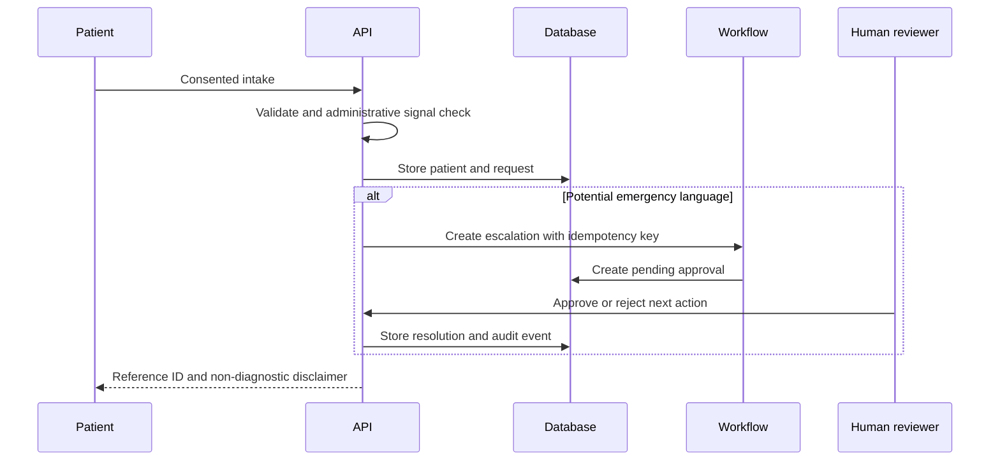

# Architecture and data flow

## Design principles

- **Business rules before model calls.** Deterministic scoring handles measurable risk factors.
- **Generation is not authority.** AI may answer from approved sources but cannot authorize actions.
- **Durable state.** Intake, approvals, workflow runs, outbox messages and audits live in PostgreSQL.
- **Replay safety.** Unique idempotency keys stop duplicate workflow side effects.
- **Replaceable edges.** The web, model provider, PostgreSQL host and automation runner can change independently.

## Core request flow

## Data model

| Table                 | Purpose                                               |
| --------------------- | ----------------------------------------------------- |
| `users`               | Staff identity and role                               |
| `patients`            | Synthetic patient contact and consent record          |
| `intake_requests`     | Requested service, message and administrative urgency |
| `appointments`        | Schedule, status and explainable risk score           |
| `approvals`           | Human decision gate and resolution evidence           |
| `workflow_runs`       | Durable status, attempts, errors and idempotency      |
| `notification_outbox` | Dry-run or deliverable communication work             |
| `knowledge_articles`  | Approved, versioned sources for the assistant         |
| `audit_logs`          | Append-oriented action history                        |

## Agent path

1. Normalize question.
2. Check for prompt-injection signals.
3. Check whether clinical judgment is requested.
4. Retrieve only approved knowledge articles.
5. Rank by overlapping content terms.
6. Return answer with article citations or escalate on no source.
7. Store grounding and escalation metadata in the audit log.

This zero-cost implementation makes the safety path observable. A hosted LLM can later be added behind the same gate, but must not bypass retrieval, policy or approval controls.
